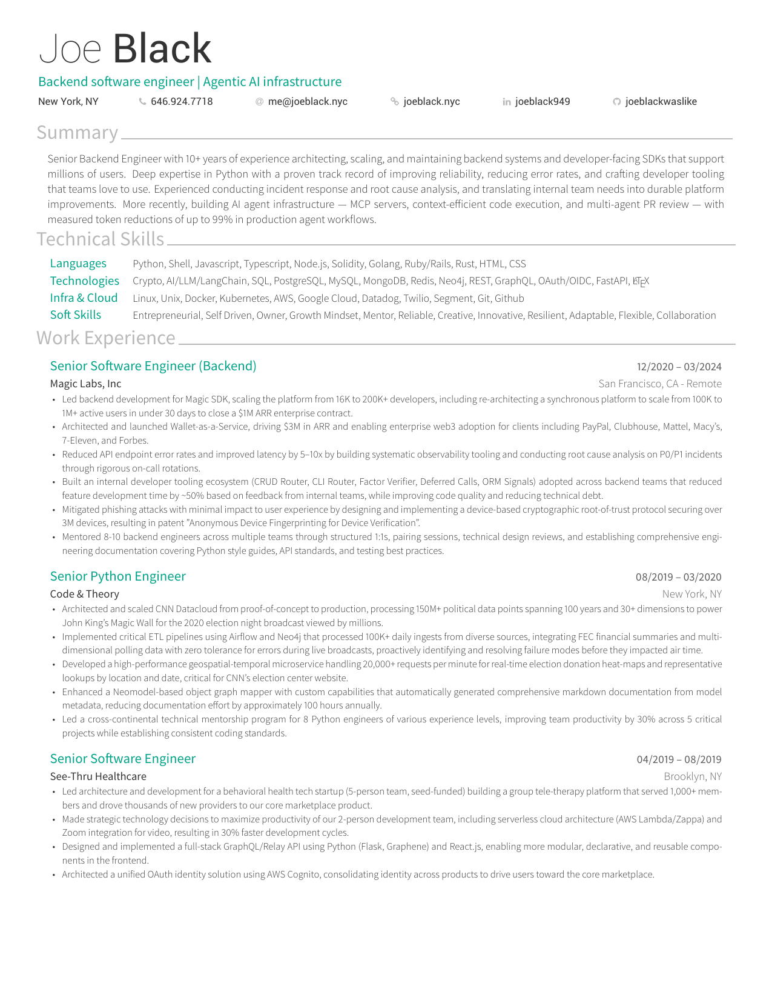
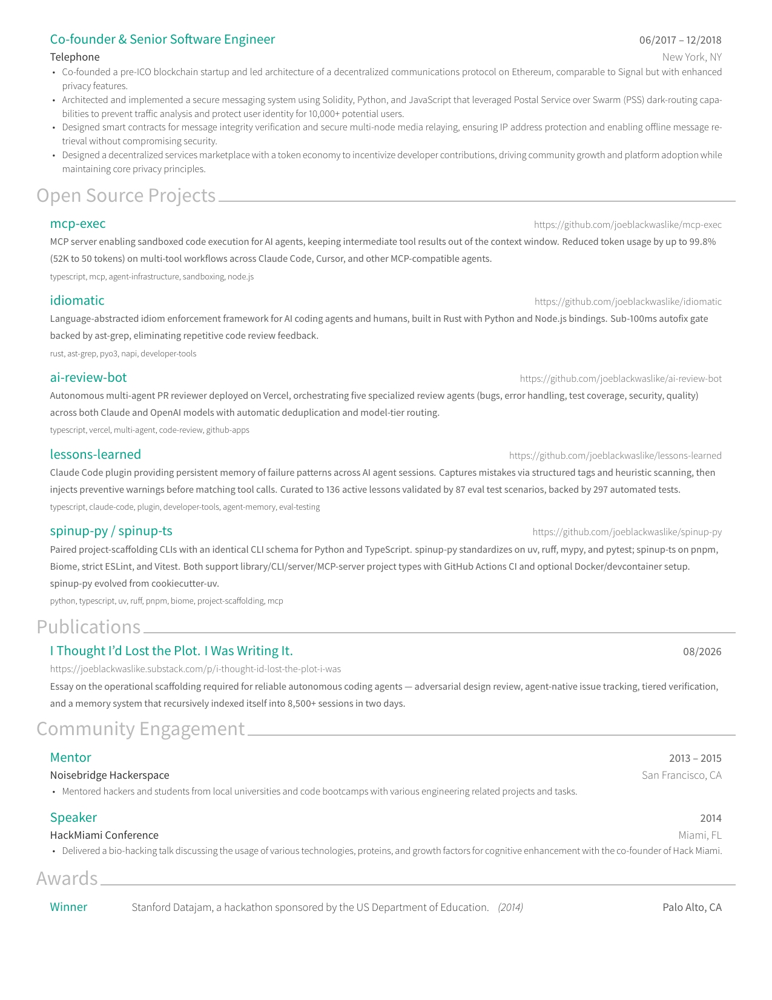

# Resume-Builder

[](https://discord.com/channels/1486035859747897414/1509515296027967550) [](https://discord.gg/Fjc9zYHZyV)


## Description
This project is a resume builder I developed for building a beautiful LaTeX typset resume from jsonresume conforming yaml data.  This allows for easy iteration and tracking of changes via diffs.  It also allows for the data itself to be used in any context where jsonresume is supported.

## Usage

* Ensure you have Docker installed and running, then pull the LaTeX image:
  `docker pull joeblackwaslike/texlive:2016`
* Install [uv](https://docs.astral.sh/uv/).
* Clone with submodules (or run `git submodule update --init --recursive` if already cloned)
  to get the jsonresume-conforming yaml data in `data/`.
* Install dependencies: `uv sync`
* Build your pdf:

  ```sh
  builder render                              # base resume
  builder render --patch python               # apply a patch
  builder render --base base-cs --patch cs     # different base + patch
  ```

  Available patches: `python`, `cs`, `ct`, `fullstack`, `mercor`, `web3`,
  `anthropic-research-tools`, `anthropic-sandboxing`
* Output lands in `export/` as `Joe_Black_v{version}[_{patch}].pdf`.

See [AGENTS.md](AGENTS.md) for the full command reference, project layout, and dev tooling
(ruff/mypy).

## Results
Here are some example's of the results, exported using `pdftoppm`.



## Showing off
And just because I'm a total nerd, here is an example of the text extracted from the pdf when running `pdftotext -layout {pdf_file}`.  This is great for ATS!

```
Joe Black
Backend software engineer | Python expert
New York, NY              646.924.7718                me@joeblack.nyc                   joeblack.nyc               joeblack949                joeblackwaslike


Summary
 Senior Backend Engineer with 10+ years of experience architecting, scaling, and maintaining backend systems and developer-facing SDKs that support
 millions of users. Deep expertise in Python with a proven track record of improving reliability, reducing error rates, and crafting developer tooling
 that teams love to use. Experienced conducting incident response and root cause analysis, and translating internal team needs into durable platform
 improvements. More recently, building AI agent infrastructure — MCP servers, context-efficient code execution, and multi-agent PR review — with
 measured token reductions of up to 99% in production agent workflows.
Technical Skills
  Languages          Python, Shell, Javascript, Typescript, Node.js, Solidity, Golang, Ruby/Rails, Rust, HTML, CSS
  Technologies       Crypto, AI/LLM/LangChain, SQL, PostgreSQL, MySQL, MongoDB, Redis, Neo4j, REST, GraphQL, OAuth/OIDC, FastAPI, LATEX
  Infra & Cloud      Linux, Unix, Docker, Kubernetes, AWS, Google Cloud, Datadog, Twilio, Segment, Git, Github
  Soft Skills        Entrepreneurial, Self Driven, Owner, Growth Mindset, Mentor, Reliable, Creative, Innovative, Resilient, Adaptable, Flexible, Collaboration

Work Experience
  Senior Software Engineer (Backend)                                                                                                             12/2020 – 03/2024
  Magic Labs, Inc                                                                                                                      San Francisco, CA - Remote
  • Led backend development for Magic SDK, scaling the platform from 16K to 200K+ developers, including re-architecting a synchronous platform to scale from 100K to
    1M+ active users in under 30 days to close a $1M ARR enterprise contract.
  • Architected and launched Wallet-as-a-Service, driving $3M in ARR and enabling enterprise web3 adoption for clients including PayPal, Clubhouse, Mattel, Macy's,
    7-Eleven, and Forbes.
  • Reduced API endpoint error rates and improved latency by 5–10x by building systematic observability tooling and conducting root cause analysis on P0/P1 incidents
    through rigorous on-call rotations.
  • Built an internal developer tooling ecosystem (CRUD Router, CLI Router, Factor Verifier, Deferred Calls, ORM Signals) adopted across backend teams that reduced
    feature development time by ~50% based on feedback from internal teams, while improving code quality and reducing technical debt.
  • Mitigated phishing attacks with minimal impact to user experience by designing and implementing a device-based cryptographic root-of-trust protocol securing over
    3M devices, resulting in patent "Anonymous Device Fingerprinting for Device Verification".
  • Mentored 8-10 backend engineers across multiple teams through structured 1:1s, pairing sessions, technical design reviews, and establishing comprehensive engi-
    neering documentation covering Python style guides, API standards, and testing best practices.

  Senior Python Engineer                                                                                                                        08/2019 – 03/2020
  Code & Theory                                                                                                                                        New York, NY
  • Architected and scaled CNN Datacloud from proof-of-concept to production, processing 150M+ political data points spanning 100 years and 30+ dimensions to power
    John King's Magic Wall for the 2020 election night broadcast viewed by millions.
  • Implemented critical ETL pipelines using Airflow and Neo4j that processed 100K+ daily ingests from diverse sources, integrating FEC financial summaries and multi-
    dimensional polling data with zero tolerance for errors during live broadcasts, proactively identifying and resolving failure modes before they impacted air time.
  • Developed a high-performance geospatial-temporal microservice handling 20,000+ requests per minute for real-time election donation heat-maps and representative
    lookups by location and date, critical for CNN's election center website.
  • Enhanced a Neomodel-based object graph mapper with custom capabilities that automatically generated comprehensive markdown documentation from model
    metadata, reducing documentation effort by approximately 100 hours annually.
  • Led a cross-continental technical mentorship program for 8 Python engineers of various experience levels, improving team productivity by 30% across 5 critical
    projects while establishing consistent coding standards.

  Senior Software Engineer                                                                                                                       04/2019 – 08/2019
  See-Thru Healthcare                                                                                                                                  Brooklyn, NY
  • Led architecture and development for a behavioral health tech startup (5-person team, seed-funded) building a group tele-therapy platform that served 1,000+ mem-
    bers and drove thousands of new providers to our core marketplace product.
  • Made strategic technology decisions to maximize productivity of our 2-person development team, including serverless cloud architecture (AWS Lambda/Zappa) and
    Zoom integration for video, resulting in 30% faster development cycles.
  • Designed and implemented a full-stack GraphQL/Relay API using Python (Flask, Graphene) and React.js, enabling more modular, declarative, and reusable compo-
    nents in the frontend.
  • Architected a unified OAuth identity solution using AWS Cognito, consolidating identity across products to drive users toward the core marketplace.
 Co-founder & Senior Software Engineer                                                                                                            06/2017 – 12/2018
 Telephone                                                                                                                                              New York, NY
 • Co-founded a pre-ICO blockchain startup and led architecture of a decentralized communications protocol on Ethereum, comparable to Signal but with enhanced
   privacy features.
 • Architected and implemented a secure messaging system using Solidity, Python, and JavaScript that leveraged Postal Service over Swarm (PSS) dark-routing capa-
   bilities to prevent traffic analysis and protect user identity for 10,000+ potential users.
 • Designed smart contracts for message integrity verification and secure multi-node media relaying, ensuring IP address protection and enabling offline message re-
   trieval without compromising security.
 • Designed a decentralized services marketplace with a token economy to incentivize developer contributions, driving community growth and platform adoption while
   maintaining core privacy principles.

Open Source Projects
 mcp-exec                                                                                                               https://github.com/joeblackwaslike/mcp-exec
 MCP server enabling sandboxed code execution for AI agents, keeping intermediate tool results out of the context window. Reduced token usage by up to 99.8%
 (52K to 50 tokens) on multi-tool workflows across Claude Code, Cursor, and other MCP-compatible agents.
 typescript, mcp, agent-infrastructure, sandboxing, node.js

 idiomatic                                                                                                              https://github.com/joeblackwaslike/idiomatic
 Language-abstracted idiom enforcement framework for AI coding agents and humans, built in Rust with Python and Node.js bindings. Sub-100ms autofix gate
 backed by ast-grep, eliminating repetitive code review feedback.
 rust, ast-grep, pyo3, napi, developer-tools

 ai-review-bot                                                                                                      https://github.com/joeblackwaslike/ai-review-bot
 Autonomous multi-agent PR reviewer deployed on Vercel, orchestrating five specialized review agents (bugs, error handling, test coverage, security, quality)
 across both Claude and OpenAI models with automatic deduplication and model-tier routing.
 typescript, vercel, multi-agent, code-review, github-apps

 lessons-learned                                                                                                  https://github.com/joeblackwaslike/lessons-learned
 Claude Code plugin providing persistent memory of failure patterns across AI agent sessions. Captures mistakes via structured tags and heuristic scanning, then
 injects preventive warnings before matching tool calls. Curated to 136 active lessons validated by 87 eval test scenarios, backed by 297 automated tests.
 typescript, claude-code, plugin, developer-tools, agent-memory, eval-testing

 spinup-py / spinup-ts                                                                                                 https://github.com/joeblackwaslike/spinup-py
 Paired project-scaffolding CLIs with an identical CLI schema for Python and TypeScript. spinup-py standardizes on uv, ruff, mypy, and pytest; spinup-ts on pnpm,
 Biome, strict ESLint, and Vitest. Both support library/CLI/server/MCP-server project types with GitHub Actions CI and optional Docker/devcontainer setup.
 spinup-py evolved from cookiecutter-uv.
 python, typescript, uv, ruff, pnpm, biome, project-scaffolding, mcp


Publications
 I Thought I'd Lost the Plot. I Was Writing It.                                                                                           joeblack.nyc • 08/2026
 https://example.com
 Essay on the operational scaffolding required for reliable autonomous coding agents — adversarial design review, agent-native issue tracking, tiered verification,
 and a memory system that recursively indexed itself into 8,500+ sessions in two days.

Community Engagement
 Mentor                                                                                                                                                  2013 – 2015
 Noisebridge Hackerspace                                                                                                                           San Francisco, CA
 • Mentored hackers and students from local universities and code bootcamps with various engineering related projects and tasks.

 Speaker                                                                                                                                                         2014
 HackMiami Conference                                                                                                                                       Miami, FL
 • Delivered a bio-hacking talk discussing the usage of various technologies, proteins, and growth factors for cognitive enhancement with the co-founder of Hack Miami.


Awards
 Winner                  Stanford Datajam, a hackathon sponsored by the US Department of Education. (2014)                                              Palo Alto, CA

```
