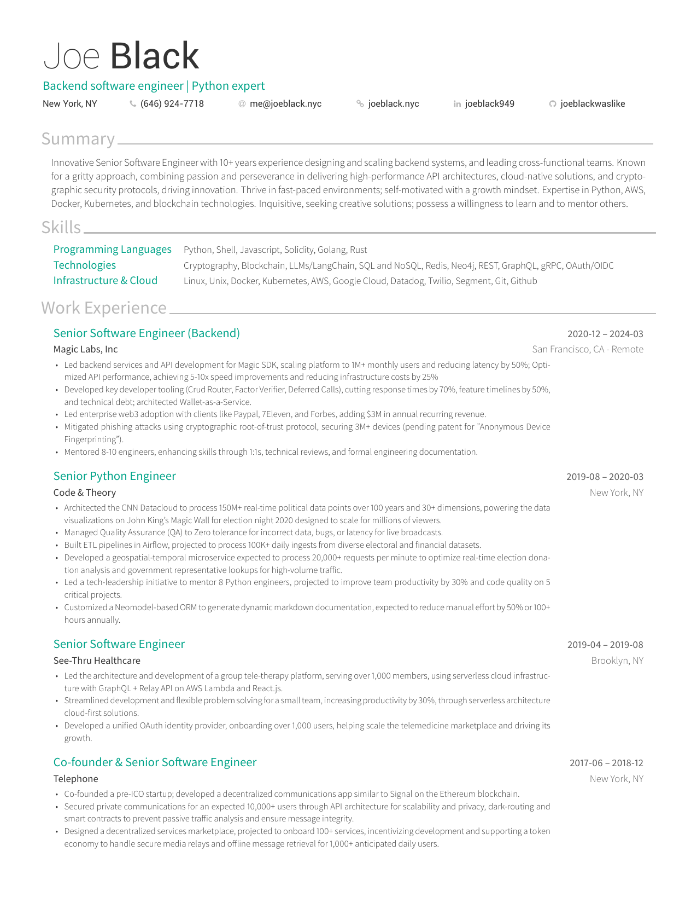
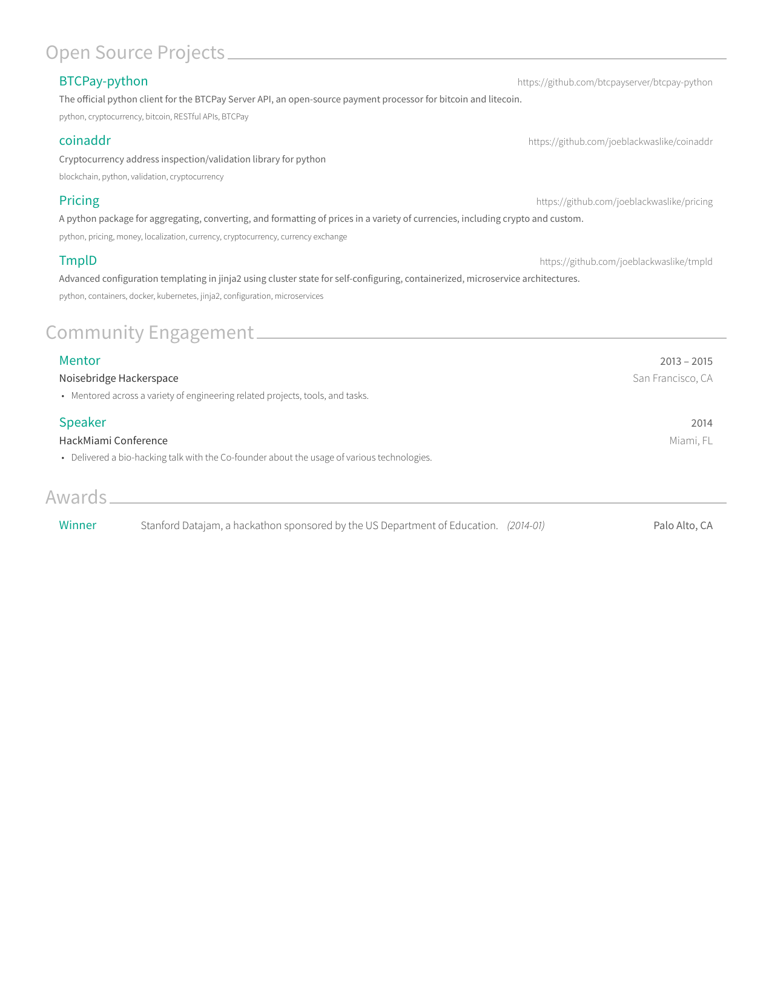

# Resume-Builder

## Description
This project is a resume builder I developed for building a beautiful LaTeX typset resume from jsonresume conforming yaml data.  This allows for easy iteration and tracking of changes via diffs.  It also allows for the data itself to be used in any context where jsonresume is supported.

## Usage
* Ensure you have docker installed and running.
* install python through pyenv `pyenv install`
* create a new venv `python venv .venv && source .venv/bin/activate`
* Install package: `pip install .`
* Ensure you have jsonresume conforming yaml data in `data/`, to use mine run: `git submodule init`.
* Build your pdf: `resume-builder render`.

## Results
Here are some example's of the results, exported using `pdftoppm`.



## Showing off
And just because I'm a total nerd, here is an example of the text extracted from the pdf when running `pdftotext -layout {pdf_file}`.  This is great for ATS!

```
Joe Black
Backend software engineer | Python expert
New York, NY             (646) 924-7718                 me@joeblack.nyc                  joeblack.nyc               joeblack949                joeblackwaslike


Summary
 Innovative Senior Software Engineer with 10+ years experience designing and scaling backend systems, and leading cross-functional teams. Known
 for a gritty approach, combining passion and perseverance in delivering high-performance API architectures, cloud-native solutions, and crypto-
 graphic security protocols, driving innovation. Thrive in fast-paced environments; self-motivated with a growth mindset. Expertise in Python, AWS,
 Docker, Kubernetes, and blockchain technologies. Inquisitive, seeking creative solutions; possess a willingness to learn and to mentor others.

Skills
  Programming Languages              Python, Shell, Javascript, Solidity, Golang, Rust
  Technologies                       Cryptography, Blockchain, LLMs/LangChain, SQL and NoSQL, Redis, Neo4j, REST, GraphQL, gRPC, OAuth/OIDC
  Infrastructure & Cloud             Linux, Unix, Docker, Kubernetes, AWS, Google Cloud, Datadog, Twilio, Segment, Git, Github


Work Experience
  Senior Software Engineer (Backend)                                                                                                            2020-12 – 2024-03
  Magic Labs, Inc                                                                                                                     San Francisco, CA - Remote
  • Led backend services and API development for Magic SDK, scaling platform to 1M+ monthly users and reducing latency by 50%; Opti-
    mized API performance, achieving 5-10x speed improvements and reducing infrastructure costs by 25%
  • Developed key developer tooling (Crud Router, Factor Verifier, Deferred Calls), cutting response times by 70%, feature timelines by 50%,
    and technical debt; architected Wallet-as-a-Service.
  • Led enterprise web3 adoption with clients like Paypal, 7Eleven, and Forbes, adding $3M in annual recurring revenue.
  • Mitigated phishing attacks using cryptographic root-of-trust protocol, securing 3M+ devices (pending patent for ”Anonymous Device
    Fingerprinting”).
  • Mentored 8-10 engineers, enhancing skills through 1:1s, technical reviews, and formal engineering documentation.

  Senior Python Engineer                                                                                                                        2019-08 – 2020-03
  Code & Theory                                                                                                                                      New York, NY
  • Architected the CNN Datacloud to process 150M+ real-time political data points over 100 years and 30+ dimensions, powering the data
    visualizations on John King’s Magic Wall for election night 2020 designed to scale for millions of viewers.
  • Managed Quality Assurance (QA) to Zero tolerance for incorrect data, bugs, or latency for live broadcasts.
  • Built ETL pipelines in Airflow, projected to process 100K+ daily ingests from diverse electoral and financial datasets.
  • Developed a geospatial-temporal microservice expected to process 20,000+ requests per minute to optimize real-time election dona-
    tion analysis and government representative lookups for high-volume traffic.
  • Led a tech-leadership initiative to mentor 8 Python engineers, projected to improve team productivity by 30% and code quality on 5
    critical projects.
  • Customized a Neomodel-based ORM to generate dynamic markdown documentation, expected to reduce manual effort by 50% or 100+
    hours annually.

  Senior Software Engineer                                                                                                                      2019-04 – 2019-08
  See-Thru Healthcare                                                                                                                                 Brooklyn, NY
  • Led the architecture and development of a group tele-therapy platform, serving over 1,000 members, using serverless cloud infrastruc-
    ture with GraphQL + Relay API on AWS Lambda and React.js.
  • Streamlined development and flexible problem solving for a small team, increasing productivity by 30%, through serverless architecture
    cloud-first solutions.
  • Developed a unified OAuth identity provider, onboarding over 1,000 users, helping scale the telemedicine marketplace and driving its
    growth.

  Co-founder & Senior Software Engineer                                                                                                          2017-06 – 2018-12
  Telephone                                                                                                                                          New York, NY
  • Co-founded a pre-ICO startup; developed a decentralized communications app similar to Signal on the Ethereum blockchain.
  • Secured private communications for an expected 10,000+ users through API architecture for scalability and privacy, dark-routing and
    smart contracts to prevent passive traffic analysis and ensure message integrity.
  • Designed a decentralized services marketplace, projected to onboard 100+ services, incentivizing development and supporting a token
    economy to handle secure media relays and offline message retrieval for 1,000+ anticipated daily users.
Open Source Projects
 BTCPay-python                                                                                                   https://github.com/btcpayserver/btcpay-python
 The official python client for the BTCPay Server API, an open-source payment processor for bitcoin and litecoin.
 python, cryptocurrency, bitcoin, RESTful APIs, BTCPay

 coinaddr                                                                                                           https://github.com/joeblackwaslike/coinaddr
 Cryptocurrency address inspection/validation library for python
 blockchain, python, validation, cryptocurrency

 Pricing                                                                                                              https://github.com/joeblackwaslike/pricing
 A python package for aggregating, converting, and formatting of prices in a variety of currencies, including crypto and custom.
 python, pricing, money, localization, currency, cryptocurrency, currency exchange

 TmplD                                                                                                                 https://github.com/joeblackwaslike/tmpld
 Advanced configuration templating in jinja2 using cluster state for self-configuring, containerized, microservice architectures.
 python, containers, docker, kubernetes, jinja2, configuration, microservices


Community Engagement
 Mentor                                                                                                                                            2013 – 2015
 Noisebridge Hackerspace                                                                                                                    San Francisco, CA
 • Mentored across a variety of engineering related projects, tools, and tasks.

 Speaker                                                                                                                                                  2014
 HackMiami Conference                                                                                                                                Miami, FL
 • Delivered a bio-hacking talk with the Co-founder about the usage of various technologies.


Awards
 Winner                 Stanford Datajam, a hackathon sponsored by the US Department of Education. (2014-01)                                     Palo Alto, CA

```
